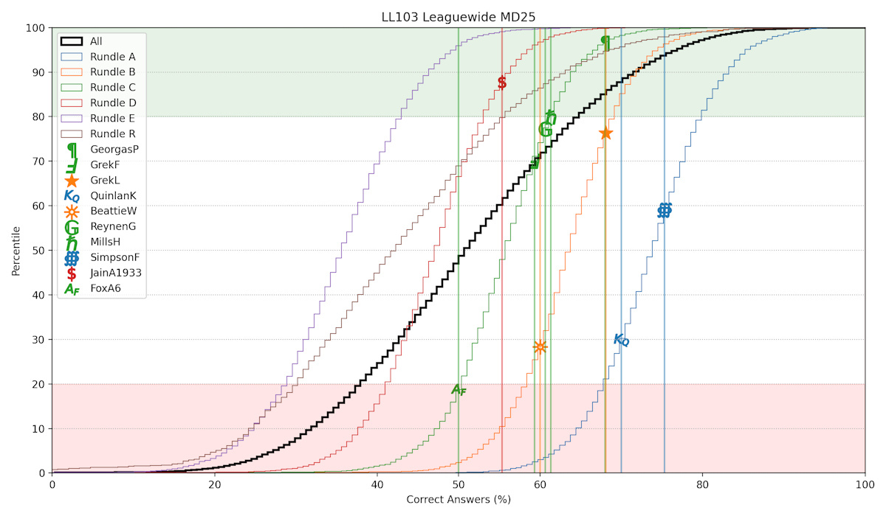

## [LearnedLeague Plotting](https://learned-league-plotter.onrender.com/)

This project generates histograms showing the performance of players in [LearnedLeague](www.learnedleague.com), an
online trivia league.

The metric most predictive of success in LearnedLeague is the fraction of questions you get correct (duh). The figure
generated shows the 'Get Rate' percentile of each inputted player, shown against cumulative percentile curves for
each 'Rundle' (division) in the league as well as the league overall. Top and bottom 20th percentiles are highlighted as
those are the rough threshold for promotion and relegation, respectively.

The project uses pyplot to generate the plot and Flask to serve as the interface between the web and the pyplot script.

This project is currently deployed on Render: [Link](https://learned-league-plotter.onrender.com/)
